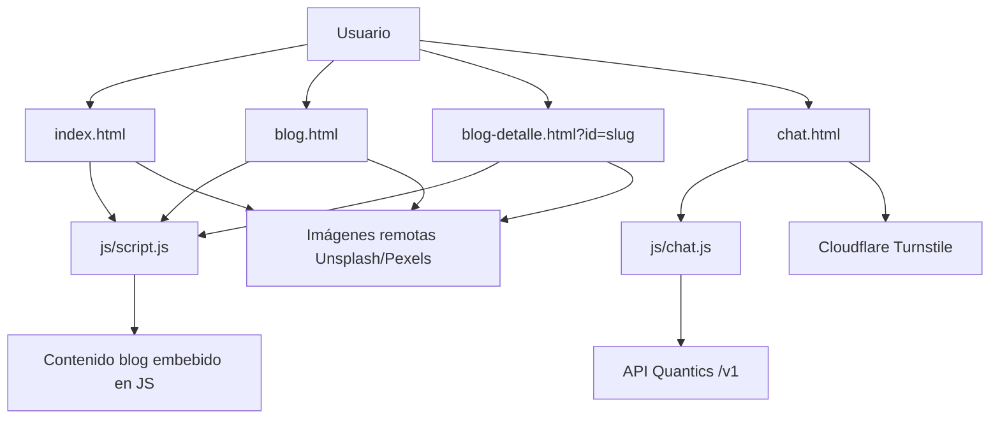
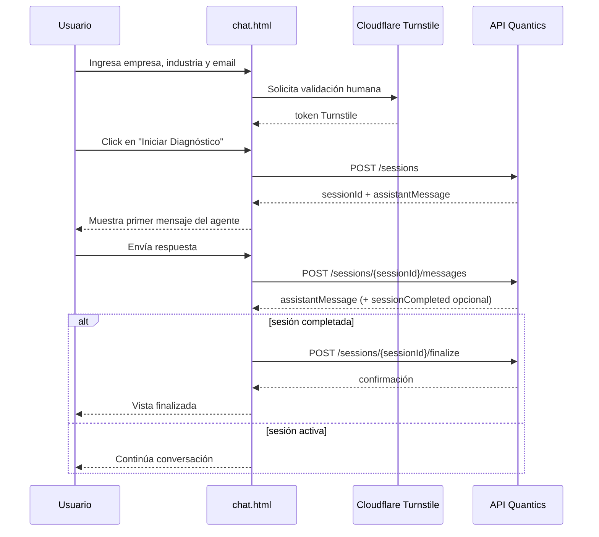
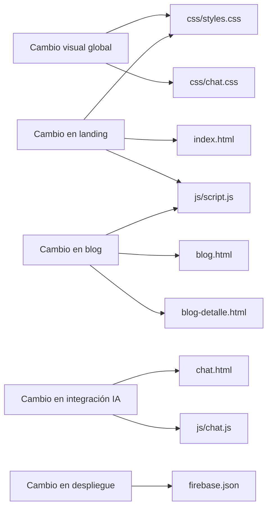

# Quantics Sitio Web

## 1. Resumen ejecutivo

Este repositorio contiene el sitio web estático de **Quantics**, orientado a presentar servicios de consultoría en innovación, automatización e inteligencia artificial, publicar artículos del blog y ejecutar un flujo de **diagnóstico comercial asistido por IA** desde la página de contacto.

Aunque el proyecto se despliega como un sitio estático, no es meramente informativo: una de sus vistas (`chat.html`) actúa como **frontend de integración** con un backend conversacional remoto. Por eso, además de la estructura visual, este documento describe con detalle el **contrato de integración** hacia los endpoints externos, los datos intercambiados y el comportamiento esperado en cada fase.

---

## 2. Objetivo del proyecto

El sitio cumple tres objetivos principales:

1. **Presentación de marca y propuesta de valor**: página principal con mensaje comercial, servicios, beneficios y CTA.
2. **Distribución de contenido editorial**: listado de artículos y página de detalle generada en cliente desde un catálogo JavaScript local.
3. **Captura y calificación inicial de leads**: experiencia guiada de diagnóstico donde un agente IA conversa con el prospecto a través de una API externa.

---

## 3. Naturaleza técnica del proyecto

### 3.1 Tipo de aplicación
- Sitio **estático** basado en HTML, CSS y JavaScript “vanilla”.
- No usa framework frontend, bundler ni pipeline de build.
- Puede ser servido directamente desde hosting estático.
- Está preparado para **Firebase Hosting** como plataforma de despliegue.

### 3.2 Tecnologías utilizadas
- **HTML5** para estructura de páginas.
- **CSS3** para layout, estilos responsivos, glassmorphism y animaciones.
- **JavaScript puro** para:
  - menús y microinteracciones;
  - renderizado dinámico del blog de detalle;
  - animaciones canvas;
  - integración con backend conversacional;
  - integración con **Cloudflare Turnstile**.
- **Firebase Hosting** para publicación estática.
- **Fuentes externas y assets remotos**:
  - Google Fonts (`Inter`);
  - Font Awesome Kit;
  - imágenes remotas desde Unsplash y Pexels.

---

## 4. Estructura del repositorio

```text
/
├── 404.html
├── blog-detalle.html
├── blog.html
├── chat.html
├── firebase.json
├── index.html
├── README.md
├── css/
│   ├── chat.css
│   └── styles.css
├── img/
│   └── 2.png
└── js/
    ├── chat.js
    └── script.js
```

### 4.1 Descripción de archivos

| Archivo | Rol |
|---|---|
| `index.html` | Landing principal de Quantics. |
| `blog.html` | Listado estático de publicaciones del blog. |
| `blog-detalle.html` | Plantilla de detalle; el contenido se inyecta desde `js/script.js` usando `?id=...`. |
| `chat.html` | Flujo de contacto/diagnóstico con integración a backend remoto. |
| `404.html` | Página 404 generada a partir del template estándar de Firebase CLI. |
| `css/styles.css` | Estilos globales de landing, blog, layout compartido y responsive. |
| `css/chat.css` | Estilos exclusivos del flujo conversacional / diagnóstico. |
| `js/script.js` | Lógica compartida de menú, tabs, blog dinámico y animación canvas general. |
| `js/chat.js` | Lógica del flujo conversacional, validación humana, estados UI y llamadas API. |
| `firebase.json` | Configuración de Firebase Hosting. |
| `img/2.png` | Logo de la marca. |

---

## 5. Arquitectura funcional



### 5.1 Separación de responsabilidades

- **HTML**: define la estructura y los puntos de montaje.
- **CSS**: resuelve la presentación visual y adaptación responsive.
- **JS compartido** (`script.js`): controla navegación, interacción visual y contenido del blog.
- **JS específico de chat** (`chat.js`): controla sesiones, mensajes, validaciones y flujos de red.
- **Backend remoto**: administra sesiones conversacionales y finalización del diagnóstico.

---

## 6. Páginas y comportamiento

## 6.1 `index.html` — Landing principal

### Propósito
Presenta la propuesta comercial de Quantics y conduce al usuario hacia el formulario/diagnóstico de contacto.

### Secciones principales
1. **Header fijo** con logo y menú hamburguesa.
2. **Menú lateral** con navegación y tarjeta destacada.
3. **Hero** con canvas animado y propuesta de valor.
4. **Nuestro Enfoque**.
5. **Servicios**.
6. **Impacto / Beneficios** con tabs e imagen dinámica.
7. **Artículos recientes**.
8. **CTA final** hacia `chat.html`.
9. **Footer** con navegación y datos de oficina.

### Lógica asociada
- Menú lateral controlado por checkbox + JavaScript.
- Tabs de beneficios con reemplazo de imagen.
- Canvas de nodos/partículas para el fondo hero.

---

## 6.2 `blog.html` — Índice editorial

### Propósito
Lista publicaciones del blog con enlaces hacia la vista de detalle.

### Observaciones
- Las tarjetas están definidas directamente en el HTML.
- Los enlaces usan el patrón:

```text
blog-detalle.html?id=<slug>
```

Ejemplos:
- `blog-detalle.html?id=llm-seguro`
- `blog-detalle.html?id=bi-accion`

---

## 6.3 `blog-detalle.html` — Detalle de artículo

### Propósito
Renderiza una publicación individual a partir de un `slug` recibido por query string.

### Cómo funciona
1. Lee `window.location.search`.
2. Obtiene el parámetro `id`.
3. Busca el `id` en el objeto `blogPosts` definido en `js/script.js`.
4. Si no existe, usa el artículo `llm-seguro` como fallback.
5. Inyecta HTML en el contenedor `#blogArticle`.
6. Construye “artículos relacionados” en `#relatedArticles`.

### Contrato interno del slug

**Entrada**: parámetro query string.

```text
?id=<slug>
```

**Tipo**: `string`

**Valores actualmente soportados**:
- `llm-seguro`
- `bi-accion`
- `agentes-rpa`
- `ia-gobierno`
- `costo-cloud`

**Fallback**:
- Si el slug es inexistente o vacío, se usa `llm-seguro`.

---

## 6.4 `chat.html` — Diagnóstico inicial con IA

### Propósito
Capturar datos básicos del prospecto, validar que sea humano y abrir una sesión conversacional con un agente remoto.

### Vistas internas del flujo
La página no navega entre rutas; usa cuatro vistas internas controladas por clases CSS:

1. **`view-1`**: formulario inicial.
2. **`view-2`**: estado de carga / transición.
3. **`view-3`**: chat activo con el agente.
4. **`view-4`**: confirmación de finalización.

### Datos solicitados al usuario
- Nombre de empresa.
- Industria / sector.
- Email de contacto.
- Token de verificación humana emitido por Cloudflare Turnstile.

### Dependencias externas de esta pantalla
- `https://challenges.cloudflare.com/turnstile/v0/api.js`
- `window.NEXUS_API_BASE_URL` o fallback local definido en la página
- API remota base: `https://api-y2upbboyhq-tl.a.run.app/v1`

---

## 7. Flujo de usuario del diagnóstico



---

## 8. Contratos de integración externos

> **Importante:** los contratos descritos abajo se infieren desde el frontend del repositorio. No existe en este código una especificación OpenAPI ni código backend, por lo que los campos documentados representan el **contrato cliente esperado** por esta implementación.

## 8.1 Base URL del backend

```text
https://api-y2upbboyhq-tl.a.run.app/v1
```

También puede sobreescribirse antes de cargar `js/chat.js` mediante:

```js
window.NEXUS_API_BASE_URL = 'https://<otra-base>/v1';
```

---

## 8.2 Endpoint: crear sesión

### Método y ruta
```http
POST /sessions
```

### Content-Type
```http
Content-Type: application/json
```

### Request esperado

```json
{
  "company": {
    "name": "Nexus Corp",
    "industry": "Finanzas"
  },
  "contact": {
    "email": "nombre@empresa.com"
  },
  "client": {
    "locale": "es-ES",
    "timezone": "America/Santiago"
  },
  "captcha": {
    "provider": "turnstile",
    "token": "<turnstile-token>"
  }
}
```

### Definición de campos

| Campo | Tipo | Obligatorio | Formato | Origen |
|---|---|---:|---|---|
| `company.name` | `string` | Sí | texto libre | input usuario |
| `company.industry` | `string` | Sí | texto libre | input usuario |
| `contact.email` | `string` | Sí | email | input usuario |
| `client.locale` | `string` | Sí | locale BCP 47 aproximado | `navigator.language` |
| `client.timezone` | `string` | Sí | nombre IANA TZ | `Intl.DateTimeFormat().resolvedOptions().timeZone` |
| `captcha.provider` | `string` | Sí | valor fijo `turnstile` | frontend |
| `captcha.token` | `string` | Sí | token opaque | Cloudflare Turnstile |

### Validaciones de frontend previas
- No permite continuar si `name`, `industry` o `email` están vacíos.
- No permite continuar si no existe token Turnstile.
- No hay validación adicional de formato de email más allá del tipo `email` del input HTML.

### Response esperado por el frontend

```json
{
  "sessionId": "sess_12345",
  "assistantMessage": "Gracias por iniciar. ¿Cuál es el principal desafío de tu empresa hoy?"
}
```

### Campos usados por el frontend

| Campo | Tipo | Uso |
|---|---|---|
| `sessionId` | `string` | Se guarda como identificador de sesión activa. |
| `assistantMessage` | `string` | Primer mensaje mostrado en el chat. |

### Fallbacks aplicados por el cliente
- Si `assistantMessage` no existe, el cliente muestra:

```text
Sesión iniciada. ¿Qué reto quieres priorizar primero?
```

### Manejo de errores
Si la respuesta HTTP no es `2xx`, el cliente intenta leer un JSON con la forma:

```json
{
  "error": {
    "message": "..."
  }
}
```

Si ese mensaje no existe, utiliza el fallback:

```text
No pudimos procesar la solicitud en este momento.
```

---

## 8.3 Endpoint: enviar mensaje a una sesión

### Método y ruta
```http
POST /sessions/{sessionId}/messages
```

### Parámetro de ruta
| Nombre | Tipo | Descripción |
|---|---|---|
| `sessionId` | `string` | Identificador retornado al crear la sesión. |

### Request esperado

```json
{
  "message": "Necesitamos automatizar nuestra operación de backoffice."
}
```

### Definición de campos

| Campo | Tipo | Obligatorio | Formato |
|---|---|---:|---|
| `message` | `string` | Sí | texto libre |

### Response esperado por el frontend

```json
{
  "assistantMessage": "Entiendo. ¿Qué procesos generan hoy mayor fricción?",
  "sessionCompleted": false
}
```

### Campos usados por el frontend

| Campo | Tipo | Uso |
|---|---|---|
| `assistantMessage` | `string` | Respuesta del agente mostrada al usuario. |
| `sessionCompleted` | `boolean` | Si es `true`, el cliente dispara la finalización. |

### Fallbacks aplicados por el cliente
- Si `assistantMessage` no existe, el cliente muestra:

```text
He registrado tu respuesta para el diagnóstico.
```

### Manejo de errores
Si falla la llamada, el chat agrega un mensaje artificial del sistema:

```text
No pude contactar al agente de IA. <detalle>
```

---

## 8.4 Endpoint: finalizar sesión

### Método y ruta
```http
POST /sessions/{sessionId}/finalize
```

### Request esperado

```json
{
  "format": "json",
  "includeTranscript": true
}
```

### Definición de campos

| Campo | Tipo | Obligatorio | Valor esperado |
|---|---|---:|---|
| `format` | `string` | Sí | `json` |
| `includeTranscript` | `boolean` | Sí | `true` |

### Response esperado por el frontend
El frontend **no consume campos específicos** del body de respuesta; únicamente necesita que la llamada responda con estado exitoso para mostrar la vista de cierre.

Ejemplo posible:

```json
{
  "status": "ok",
  "summaryGenerated": true
}
```

### Manejo de errores
Si la finalización falla, el cliente:
1. vuelve a la vista del chat;
2. inserta un mensaje de error;
3. rehabilita el input para continuar o reintentar.

---

## 8.5 Contrato de errores HTTP consumido por el cliente

Para cualquiera de los tres endpoints, el cliente intenta resolver el mensaje de error en este orden:

1. `response.json()`
2. `data.error.message`
3. fallback genérico

### Forma de error recomendada para compatibilidad

```json
{
  "error": {
    "message": "Descripción legible del problema"
  }
}
```

---

## 8.6 Integración con Cloudflare Turnstile

### Script cargado
```html
<script src="https://challenges.cloudflare.com/turnstile/v0/api.js" async defer></script>
```

### Widget configurado
- **Provider**: Cloudflare Turnstile.
- **Site key pública**: `0x4AAAAAACrvwz0HKnicGq56`.

### Callbacks esperados por el frontend
- `onTurnstileSuccess(token)`
- `onTurnstileExpired()`
- `onTurnstileError()`

### Contrato del token
| Campo | Tipo | Descripción |
|---|---|---|
| `captcha.token` | `string` | Token opaco emitido por Turnstile para verificación server-side. |

### Consideraciones
- El token se almacena transitoriamente en `window.__turnstileState` y en memoria JS.
- Si la creación de sesión falla, el cliente intenta reiniciar el widget con `turnstile.reset('#turnstile-widget')`.
- La verificación real del token ocurre presumiblemente en backend; este repositorio solo envía el token.

---

## 9. Modelo de datos local del blog

El blog no consume un CMS ni API. El contenido vive embebido en `js/script.js` bajo el objeto `blogPosts`.

### Estructura del contrato interno por artículo

```json
{
  "title": "Título del artículo",
  "date": "12.02.2026",
  "author": "Equipo Quantics",
  "readTime": "6 min de lectura",
  "image": "https://...",
  "imageAlt": "Texto alternativo",
  "intro": "Resumen introductorio",
  "sections": [
    {
      "heading": "Subtítulo",
      "paragraphs": ["Párrafo 1", "Párrafo 2"],
      "bullets": ["Item 1", "Item 2"]
    }
  ]
}
```

### Implicancias
- Agregar un artículo requiere editar **HTML** y **JavaScript** en más de un lugar.
- No existe paginación, búsqueda ni CMS.
- El detalle del artículo se genera completamente del lado cliente.

---

## 10. Interacciones UI y comportamiento de scripts

## 10.1 `js/script.js`

### Responsabilidades
- Efecto del cursor decorativo.
- Apertura/cierre del menú lateral.
- Cambio de tabs en la sección de beneficios.
- Catálogo y renderizado del blog de detalle.
- Renderizado de artículos relacionados.
- Animación canvas de fondo en páginas compatibles.

### Consideraciones técnicas
- El archivo centraliza tanto interacción del sitio como contenido editorial.
- Esto simplifica despliegue, pero mezcla responsabilidad de UI con gestión de datos.

## 10.2 `js/chat.js`

### Responsabilidades
- Estado del flujo de diagnóstico.
- Gestión del token Turnstile.
- Construcción de payloads al backend.
- Renderizado incremental de mensajes.
- Control de estados `loading`, `typing`, `completed`.
- Finalización automática cuando `sessionCompleted === true`.

### Variables de estado principales
| Variable | Propósito |
|---|---|
| `companyData` | Almacena datos básicos capturados del prospecto. |
| `chatSessionId` | ID de sesión remota activa. |
| `isSendingMessage` | Evita envíos duplicados de mensajes. |
| `isStartingFlow` | Evita doble submit al crear sesión. |
| `humanVerificationToken` | Token Turnstile actual. |

---

## 11. Despliegue y hosting

## 11.1 Firebase Hosting

El archivo `firebase.json` indica:

- `public: "."` → la raíz del repo se publica directamente.
- `ignore` → se excluyen `firebase.json`, archivos ocultos y `node_modules`.
- `cleanUrls: true` → Firebase puede servir URLs sin extensión `.html`.
- `trailingSlash: false` → evita slash final forzado.

### Consecuencia práctica
Aunque los archivos físicos son `index.html`, `blog.html`, `chat.html`, etc., Firebase puede exponer rutas limpias si se configuran acorde al hosting.

---

## 11.2 Ejecución local

Como no hay build ni dependencias de Node, basta un servidor HTTP estático.

### Opción recomendada
```bash
python3 -m http.server 8000
```

Luego abrir:
- `http://localhost:8000/`
- `http://localhost:8000/blog.html`
- `http://localhost:8000/blog-detalle.html?id=llm-seguro`
- `http://localhost:8000/chat.html`

### Importante
Abrir los HTML con `file://` no siempre reproduce correctamente el comportamiento esperado de navegación, recursos o integraciones externas.

---

## 12. Dependencias externas y superficies de integración

## 12.1 Recursos cargados desde terceros

| Servicio | Uso |
|---|---|
| Google Fonts | Fuente `Inter`. |
| Font Awesome Kit | Íconos. |
| Cloudflare Turnstile | Verificación humana. |
| API Quantics | Chat y diagnóstico remoto. |
| Unsplash / Pexels | Imágenes de contenido y decorativas. |

### Implicancias operativas
- El sitio depende de conectividad a terceros para verse/funcionar plenamente.
- Si Font Awesome o Google Fonts fallan, el sitio sigue operando pero con degradación visual.
- Si Turnstile o la API fallan, `chat.html` pierde su funcionalidad principal.

---

## 13. Riesgos, limitaciones y supuestos actuales

## 13.1 Limitaciones funcionales
- No hay backend versionado dentro de este repositorio.
- No hay documentación formal del API fuera del contrato inferido por el cliente.
- No existe sistema de analytics visible en el código.
- No hay tests automatizados.
- No existe accesibilidad avanzada documentada ni validada formalmente.
- No hay internacionalización real; el contenido está en español pero algunas etiquetas/404 siguen en inglés.

## 13.2 Limitaciones de contenido
- El blog está hardcodeado en JS/HTML.
- Enlaces de redes y varias secciones apuntan a `#`.
- La dirección física y textos institucionales están incrustados en HTML.
- La página `404.html` aún conserva el template genérico de Firebase.

## 13.3 Supuestos de integración
Este frontend **supone** que el backend:
- acepta CORS desde el dominio del sitio;
- responde JSON en todos los endpoints;
- usa `sessionId` como identificador primario de conversación;
- valida Turnstile server-side;
- permite finalizar sesiones con un POST adicional.

---

## 14. Recomendaciones para un tercero que mantendrá el proyecto

## 14.1 Si necesitas cambiar contenido institucional
Revisar principalmente:
- `index.html`
- `blog.html`
- `blog-detalle.html`
- `js/script.js`

## 14.2 Si necesitas cambiar el endpoint backend
Modificar la asignación en `chat.html`:

```html
<script>
  window.NEXUS_API_BASE_URL = 'https://nuevo-backend/v1';
</script>
```

O definirla antes de cargar `js/chat.js` si este HTML pasa a ser parte de otro contenedor.

## 14.3 Si necesitas extender el contrato del chat
Coordinar frontend y backend sobre:
- campos adicionales en `POST /sessions`;
- semántica de `sessionCompleted`;
- esquema de error;
- shape de la respuesta de `finalize`;
- expiración/renovación del token Turnstile.

## 14.4 Si necesitas profesionalizar el proyecto
Siguiente evolución sugerida:
1. Extraer contenido a un CMS o JSON estructurado.
2. Definir OpenAPI para el backend.
3. Incorporar tests end-to-end del flujo de chat.
4. Agregar observabilidad y analytics.
5. Mejorar accesibilidad, SEO y metadatos sociales.
6. Reemplazar enlaces `#` por destinos reales.

---

## 15. Mapa rápido de mantenimiento



---

## 16. Checklist de entendimiento para un externo

Una persona nueva debería salir de este README entendiendo que:

- el proyecto es un **sitio estático** sin build;
- la parte de blog es **cliente + contenido embebido**;
- la página de contacto no es solo un formulario, sino un **cliente conversacional**;
- el sitio depende de una **API externa** y de **Cloudflare Turnstile**;
- el contrato con el backend se resume en tres POSTs:
  - crear sesión,
  - enviar mensajes,
  - finalizar sesión;
- la infraestructura de publicación actual es **Firebase Hosting**.

---

## 17. Glosario breve

- **Sitio estático**: aplicación servida como archivos preconstruidos sin render server-side propio.
- **Turnstile**: mecanismo de validación anti-bot de Cloudflare.
- **sessionId**: identificador de conversación generado por backend.
- **assistantMessage**: mensaje textual que el frontend muestra como respuesta del agente.
- **sessionCompleted**: bandera que indica al frontend que debe cerrar la entrevista.

---

## 18. Resumen final

Este proyecto es un **frontend estático corporativo** con una **capacidad transaccional puntual**: iniciar y sostener una conversación de diagnóstico con un backend remoto de IA. La comprensión real del sistema exige mirar no solo el diseño de páginas, sino también el contrato de integración del chat. Ese contrato, documentado aquí desde el comportamiento observable del código cliente, es la pieza clave para mantener, migrar o extender el proyecto sin romper la experiencia comercial.
